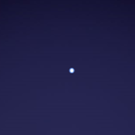
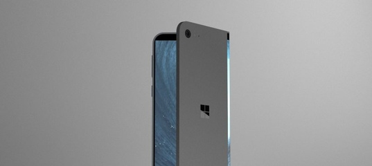
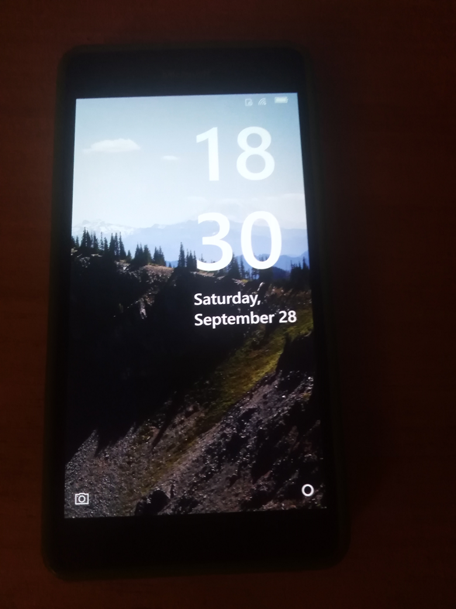
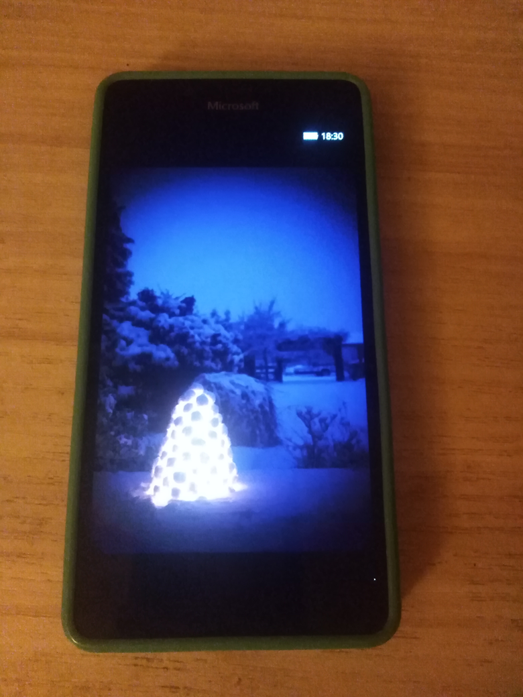
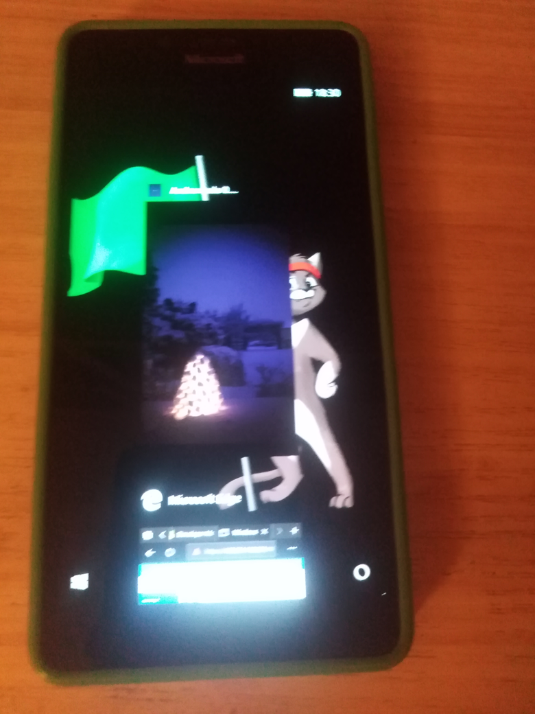
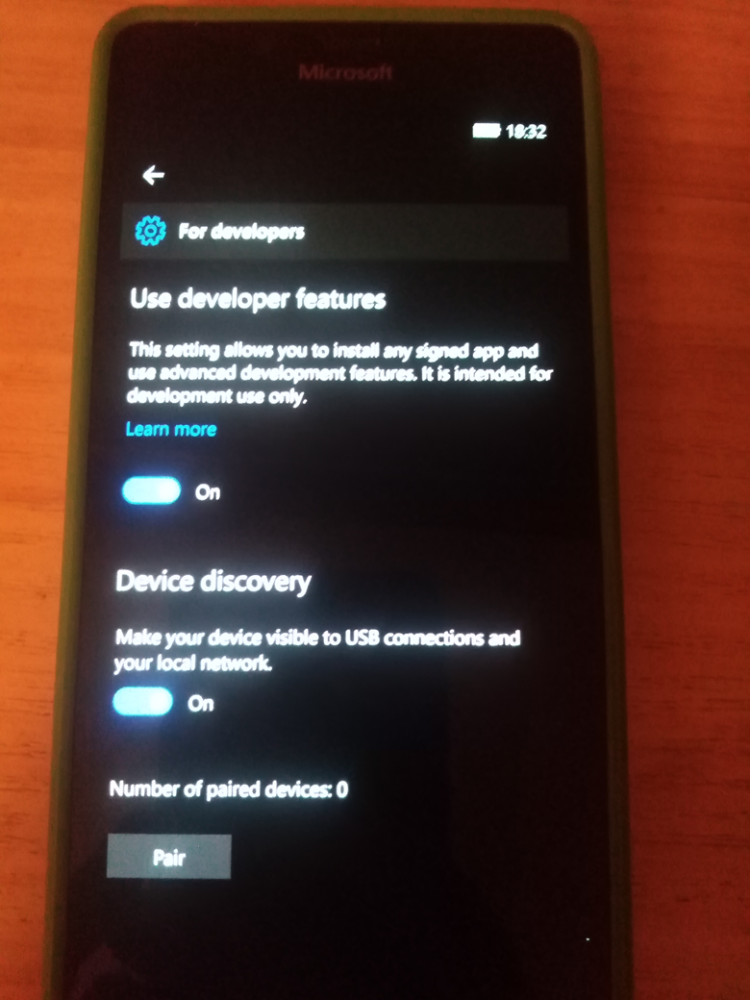

# Andromeda v0.0.2

Andromeda project - related docs / notes / etc.

## Screenshot(s)

## Repo structure

:: Sources folder

:: :: DummyApps (TargetPlatformMinVersion = 10.0.17134.0)
- Andromeda Dummy App :)

:: :: TestApps (TargetPlatformMinVersion = 10.0.16299.0)
- 00_BlankApp  Blank App (first bird, for brave!) 
- 01_DelpoyApp1  Blank App only for deploy & realtime debug testing

:: Documentation folder

:: :: Some Andromeda-related docs (guides, etc.)
- How to flash AndromedaOS 17686 - v2.0a (EN)  (English original)
- How to flash AndromedaOS 17686 - v2.0a (RU)  (Russian translation)
- How to flash AndromedaOS 17686 - v2.0a (CN)  (Chinese translation)

:: Sketches folder
- Some design "fantasies" )) 

:: Status (my 2 cents to Andromeda project)
- Andromeda app was successfully "incorporated" (installed) to Andromeda via Portal. 
- Blank app was installed to Andromeda via Portal too (success)
- Realtime debuging (VS 2017 & V 2022 & DeployApp1 used) failed (Deploy error, sadly) 

## Wiki 

The Andromeda Wiki here: 

https://github.com/mediaexplorer74/Andromeda/wiki

## Credits 
- [Ritsu_909](https://github.com/Ritsu909) : He show me how todo it. 
- [Gus_33000](https://github.com/Gus33000) : He shared several files and tools to help. 
- [OrangeRa1n](https://github.com/OrangeRa1n) : She shared the Image files of Andromeda. 
- [Empyreal96](https://github.com/Empyreal96) : He taught me a lot of theoretical knowledge.
- [Steve_246](https://github.com/SteveNo246) : He gave me a Retail Lumia 950 to test this method.
- [Abc145](https://github.com/Abc145) : He taught me a lot of practical knowledge.
- And everyone who works hard for Windows Phone. :)

## Licensing
- MIT License

## ..
As is. No support. RnD only / DIY 

## .

[m][e] September, 2024 

